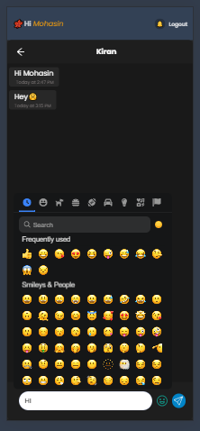

# ChatApp


Welcome to ChatApp, a real-time messaging application that keeps you connected with your friends and colleagues. With an intuitive interface and a range of features, ChatApp makes communication seamless and fun.

## Features

1. **User Registration and Login:**
   - Create a new profile and securely log in.

2. **Online Status:**
   - See who is online in real-time.

3. **Real-Time Messaging:**
   - Enjoy instant messaging with other users.

4. **Create New Chats:**
   - Start new conversations with any user.

5. **Unread Message Notifications:**
   - Get notified of unread messages.

6. **Responsive Design:**
   - Mobile-friendly interface for seamless use on any device.

7. **Send Emojis:**
   - Enhance your conversations with a wide range of emojis.

## Technology Stack

- **Front-end:** React.js, useContext, TailwindCSS
- **Back-end:** Node.js, MongoDB
- **Real-time Communication:** Socket.io

## Getting Started

Follow these instructions to get a copy of the project up and running on your local machine.

### Prerequisites

- Node.js and npm installed on your machine.

### Installation

1. Clone the repository:

   ```bash
   git clone https://github.com/msdian0007/chatApp.git
   cd chatapp
   ```

2. Install dependencies for the client, server, and socket:

   ```bash
   cd client
   npm install
   cd ../server
   npm install
   cd ../socket
   npm install
   ```

3. Set up your environment variables:
   - Create a `.env` file in the `server` directory.
   - Add your MongoDB URI with the collection name `chatApp`:

     ```env
     MONGODB_URI=your_mongodb_uri
     ```

### Running the App

1. Start the server:

   ```bash
   cd server
   npm start
   ```

2. Start the client:

   ```bash
   cd client
   npm start
   ```

3. Start the socket server:

   ```bash
   cd socket
   npm start
   ```

Open your browser and navigate to `http://localhost:3000` to see the application in action.

## Screenshots


-*Login Screen*

-*Register Screen*

-*Home Screen*

-*Chat Screen*

-*Notification Screen*

-*Chat-List Mobile Screen*

-*Chat Mobile Screen*

-*Chat Mobile Screen*

## Contributing

We welcome contributions! Please fork the repository and submit pull requests.

## License

This project is licensed under the MIT License.

## Acknowledgments

- Thanks to the creators of React, TailwindCSS, Node.js, MongoDB, and Socket.io for their fantastic tools.
